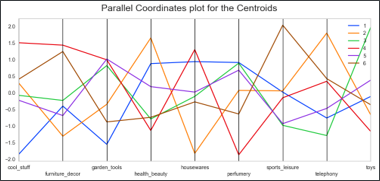

# E-Commerce Customer Segmentation

In this project, I perform the segmentation of the user base of a Brazilian website.

The dataset can be found online at [Olist Dataset](https://www.kaggle.com/datasets/olistbr/brazilian-ecommerce).

This project highlights the data cleaning, feature enginnering and feature selection processes.

After the data has been preprocessed, I compare several clustering models and select DBScan.

The modelling is used to infer characteristics about each customer segments that could then
be used during a marketing campaign.

## Useful Links

* [Project presentation (Powerpoint)](Project_Presentation.pptx)
* [Jupyter Notebook](Commercial_API_notebook)

## Screenshots

### Data Analysis

### Clustering

#### DBSCAN Silhouette Plot

#### Segment characteristics (parallel coordinates plots)

## Libraries / Packages Used

* [Scikit-Learn](https://scikit-learn.org/)
* [Geopy](https://geopy.readthedocs.io/)
* [Clusteval](https://erdogant.github.io/clusteval/)
* [Yellowbrick](https://www.scikit-yb.org/)
* Matplotlib / Seaborn
* Pandas / Numpy 

## Developed By

Octave Antoni

[Connect with me on Linkedin](https://www.linkedin.com/in/octave-antoni/)

## License

    Copyright 2023 Octave Antoni

    Licensed under the Apache License, Version 2.0 (the "License");
    you may not use this file except in compliance with the License.
    You may obtain a copy of the License at

        http://www.apache.org/licenses/LICENSE-2.0

    Unless required by applicable law or agreed to in writing, software
    distributed under the License is distributed on an "AS IS" BASIS,
    WITHOUT WARRANTIES OR CONDITIONS OF ANY KIND, either express or implied.
    See the License for the specific language governing permissions and
    limitations under the License.
